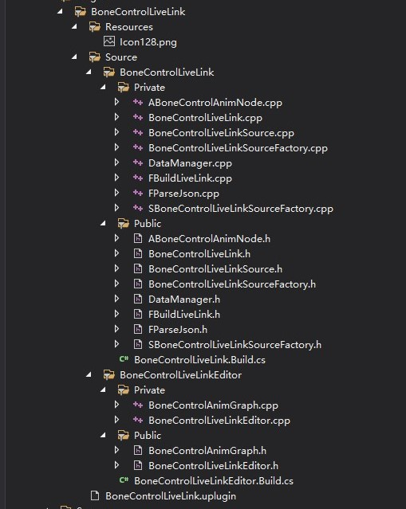
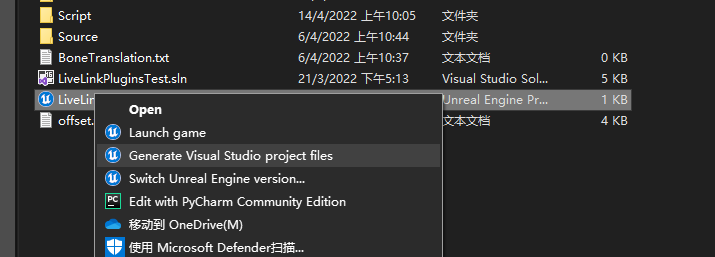

# Live Link 插件

## 相关参考项目地址：
### 1. [JsonLiveLink](https://github.com/ue4plugins/JSONLiveLink)
### 2. [HoudiniLiveLink](https://github.com/sideeffects/HoudiniLiveLink)
### 3. [RokokoLiveLink](https://www.rokoko.com/integrations/3d-character-animation-in-unreal) 直接官网下载    
#


### 该项目大致可以分为两个模块 LiveLink模块 动画蓝图模块。
### 其中ABoneControlAnimNode 和 BoneControlAnimGraph 为动画蓝图模块，主要用于获取模型骨骼位移信息和判断模型类型
### BoneControlLiveLink 用于链接LiveLink模块，并编译相应头文件。 BoneControlLiveLinkSource、BoneControlLiveLinkSourceFactory、SBoneControlLiveLinkSource为LiveLink源必备项目，详情可见[LiveLink插件开发](https://docs.unrealengine.com/4.27/zh-CN/AnimatingObjects/SkeletalMeshAnimation/LiveLinkPlugin/LiveLinkPluginDevelopment/)
### 另外我把构建LiveLink Role和解析JSon文件分别放在FBuildLiveLink 和 FParseJson中。DataManger我写了一个单例用于存储骨骼位移信息。
> ### 其中Resource目录下存放插件的图标，Source下存放相关代码和配置文件，BoneCotrolLiveLink.uplugin为系统生成。 *虚幻引擎通过在磁盘上搜索 .uplugin 文件来查找插件。将此类文件称为 插件描述文件。其是提供插件相关基本信息的文本文件。运行此类程勋时，引擎、编辑器和 UnrealBuildTool（UBT）将自动发现并自动加载插件描述文件。* 
> ### 具体参考虚幻引擎官网 [插件](https://docs.unrealengine.com/4.26/zh-CN/ProductionPipelines/Plugins/)


> ## 链接动画模块（自定义动画节点）
> ### 创建自定义动画节点需要先添加Editor模块   参考:[链接Editor模块](https://unrealcommunity.wiki/creating-an-editor-module-x64nt5g3)
> ### 大致流程：
>  1. 创建文件夹 ，文件夹名为"插件名+Editor"，如上图中BoneControlLiveLinkEditor。并添加与文件夹同名的源文件和头文件，如上图中的BoneControlLiveLinkEditor.h和BoneControlLiveLinkEditor.cpp这两个文件仅用于链接Editor模块。同时添加.build.cs文件文件名也同该文件夹名，即上图中的BoneControlLiveLink.Build.cs，该文件用于添加需要的相关模块。
> 2. 向 .uplugin文件中添加Editor模块，如下：
>``` "Modules": [
>   {
>      "Name": "BoneControlLiveLink",
>      "Type": "Runtime",
>      "LoadingPhase": "Default",
>      "WhitelistPlatforms": [
>        "Win64",
>        "Win32"
>      ]
>    },
>    {
>      "Name": "BoneControlLiveLinkEditor",
>      "Type": "UncookedOnly",
>      "LoadingPhase": "PreDefault",
>      "WhitelistPlatforms": [
>        "Win64",
>        "Win32"
>      ]
>    }
>  ],
>  ```
> 此处创建文件或文件夹，建议在外部文件资源管理器中创建，不要在VS中创建。并右键项目路径下的.uproject文件,重新生成.
> 
***

# 自定义蓝图节点
## [官方参考教程](https://unrealcommunity.wiki/animation-nodes-code-for-how-to-create-your-own-gq0xucwi)可参考大致思路，但是代码有问题。